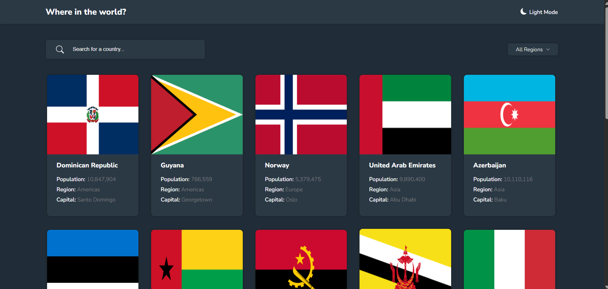
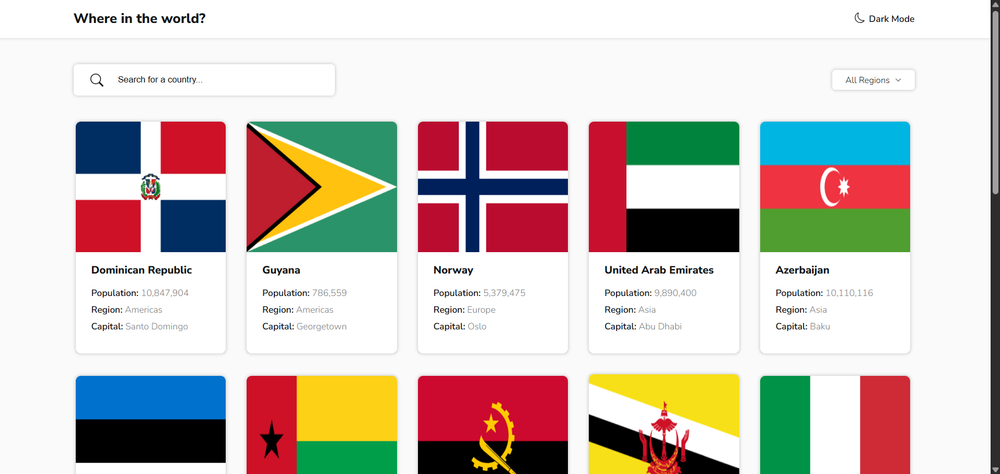
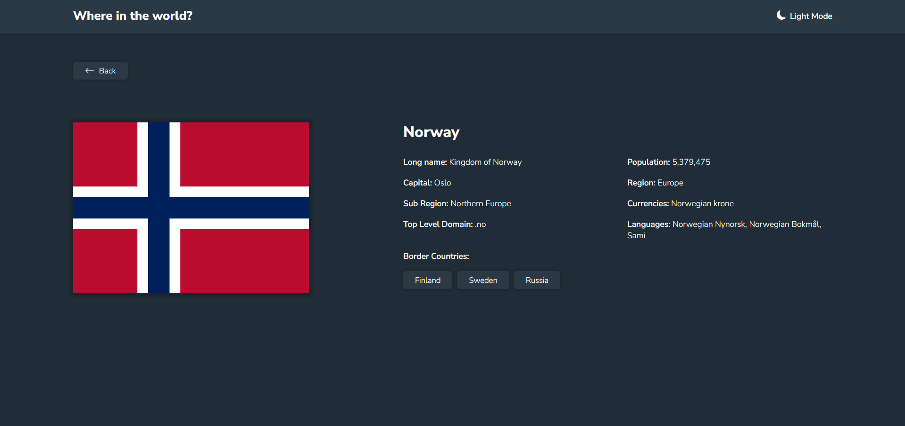
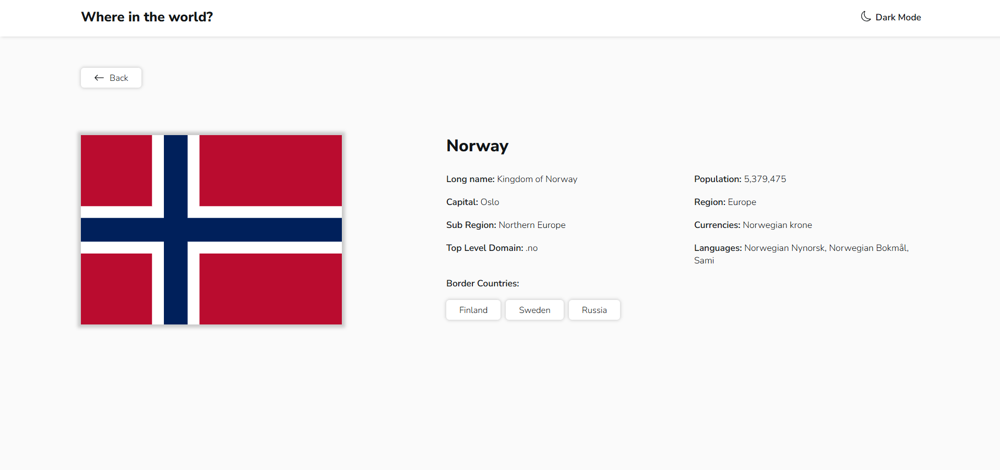
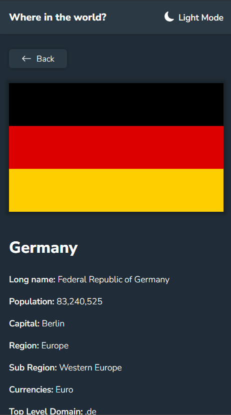
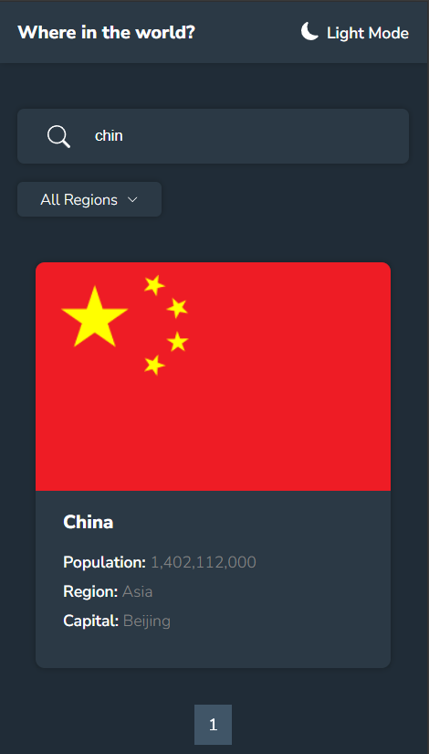

# Countries Explorer (Frontend Mentor Challenge)

Eine interaktive Webanwendung zur Erkundung von Ländern weltweit. Entwickelt mit **React**, **TypeScript** und **CSS Modules**. Inspiriert von einer Aufgabe auf der Plattform Frontend Mentor.

## Funktionen

- Ländersuche nach Name
- Filterung nach Region
- Detaillierte Länderinformationen:
  - Hauptstadt, Region, Subregion
  - Bevölkerung, Sprachen, Währung, Top-Level-Domain
  - Nachbarländer
- Hell- und Dunkelmodus
- Responsives Design
- Paginierung der Länderliste
- Anzeige des Ladezustands

## Technologien

- React + TypeScript
- CSS Modules
- REST API: [https://restcountries.com](https://restcountries.com)
- Tanstack/React-query – für Datenabruf, Caching und Ladezustand
- Inspiration: Frontend Mentor Challenge

## Was ich selbst umgesetzt habe:

- Getypte Komponenten
- Light- und Dark-Theme
- Komponentenbasierte Architektur
- Suche und Filterfunktion
- Integration einer externen API
- Paginierung mit seitenweiser Nachladung
- Daten-Caching und Ladeanzeige mit React Query
- Loader-Komponente zur Anzeige des Ladezustands

## Online-Zugang

Das Projekt ist auf meinem eigenen Server basierend auf einem Raspberry Pi 4 gehostet, der bei mir zu Hause steht. Verwendete Technologien:

- Ubuntu Server 22.04
- Cloudflare Tunnel für sicheren öffentlichen Zugriff
- HTTPS-Zertifikate
- Eigene Domain
- Demo: https://countries.bilytskyi.com

## Screenshots

